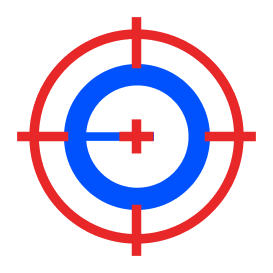
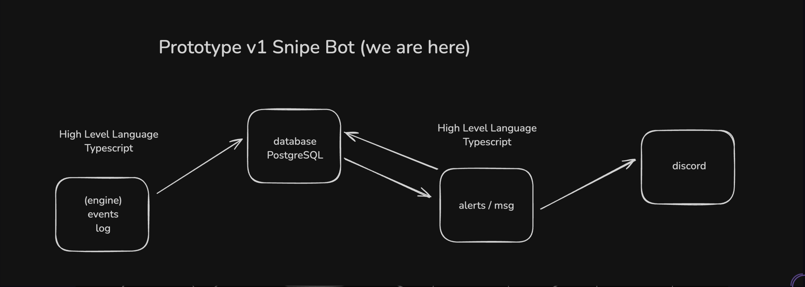
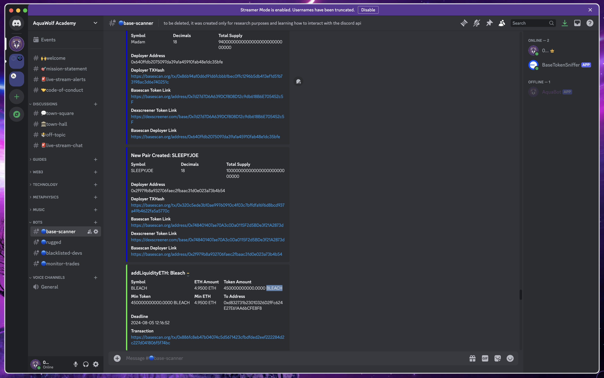

<!-- Improved compatibility of back to top link: See: https://github.com/othneildrew/Best-README-Template/pull/73 -->
<a id="readme-top"></a>
<!--
*** Thanks for checking out the Best-README-Template. If you have a suggestion
*** that would make this better, please fork the repo and create a pull request
*** or simply open an issue with the tag "enhancement".
*** Don't forget to give the project a star!
*** Thanks again! Now go create something AMAZING! :D
-->


<!-- PROJECT SHIELDS -->
<!--
*** I'm using markdown "reference style" links for readability.
*** Reference links are enclosed in brackets [ ] instead of parentheses ( ).
*** See the bottom of this document for the declaration of the reference variables
*** for contributors-url, forks-url, etc. This is an optional, concise syntax you may use.
*** https://www.markdownguide.org/basic-syntax/#reference-style-links
-->


<!-- PROJECT LOGO -->
<br />
<div align="center">
  <a href="">
    
  </a>

  <h3 align="center">Web3 Base Chain Sniper Bot</h3>

  <p align="center">
    Filter out the garbage. Find the gems 💎. Land on the moon 🚀
    <br />
    <!-- <a href="https://github.com/othneildrew/Best-README-Template"><strong>Explore the docs »</strong></a> -->
    <br />
    <br />
    <a href="">View Demo</a>
    ·
    <a href="https://github.com/0xAquaWolf/base-chain-sniper-bot-ts/issues">Report Bug</a>
    ·
    <a href="https://github.com/0xAquaWolf/base-chain-sniper-bot-ts/issues">Request Feature</a>
  </p>
</div>


<!-- TABLE OF CONTENTS -->
<details>
  <summary>Table of Contents</summary>
  <ol>
    <li>
      <a href="#about-the-project">About The Project</a>
      <ul>
        <li><a href="#built-with">Built With</a></li>
      </ul>
    </li>
    <li>
      <a href="#getting-started">Getting Started</a>
      <ul>
        <li><a href="#prerequisites">Prerequisites</a></li>
        <li><a href="#installation">Installation</a></li>
      </ul>
    </li>
    <li><a href="#usage">Usage</a></li>
    <li><a href="#roadmap">Roadmap</a></li>
    <li><a href="#contributing">Contributing</a></li>
    <li><a href="#license">License</a></li>
    <li><a href="#contact">Contact</a></li>
    <li><a href="#acknowledgments">Acknowledgments</a></li>
  </ol>
</details>


<!-- ABOUT THE PROJECT -->
## About The Project





Creating this project live on stream: https://www.youtube.com/@0xAquaWolf

I have always dreamed about finding a infinite money glitch, making money passivly while i'm sleeping, its one of the reasons i learned how to code. 

This project endevours to accomplish this goal. If you resonate with that you can contribute to if you would like.

Here's why:
* I believe that Base Chain (built by Coinbase) will on board and increase user adoption with the Web3 space because they have 115 MAU and they have already onboarded 11.3 Million users
https://tokenterminal.com/terminal/projects/base (MAU)


* I see code as leverage, we can deploy bots and run code in the cloud while we are sleeping.
* If you know how to code you should be able to make money with your code directly not relying on 3rd parties like customer and dealing with customer support while building a product

<p align="right">(<a href="#readme-top">back to top</a>)</p>

### Built With

* 
* 
* 
* 
* 
* 

<p align="right">(<a href="#readme-top">back to top</a>)</p>


<!-- GETTING STARTED -->
## Getting Started

To get a local copy up and running, follow these steps:

### Prerequisites

* Install Bun (a fast JavaScript runtime and package manager)
  ```sh
  curl -fsSL https://bun.sh/install | bash
  ```

### Installation


1. Get a BaseScan free API Key at [https://basescan.org/](https://basescan.org/)
2. Get a Discord Developer free API Key at [Discord Developer Portal](https://discord.com/developers/)
2. Clone the repo
   ```sh
   git clone https://github.com/0xAquaWolf/base-chain-sniper-bot-ts.git
   ```
3. Install NPM packages
   ```sh
   bun install
   ```
4. Enter your API in `.env`
   ```bash
    DISCORD_BOT_TOKEN="" # Slash Commands Discord bot
    BASE_TOKEN_SNIFFER="" # Discord Bot for blockchain notifications
    BASESCAN_API_TOKEN="" # sign up on basescan to get api key
    STAGING_CHANNEL_ID="" # copy from discord server
    DEBUG="true | false"
    CUSTOM_START_BLOCK="123512352" # for debuging from a block
    DB_HOST="localhost"
    DB_PORT="2341"
    DB_USER="default"
    DB_PASSWORD=""
    DB_NAME="database_name"
   ```
<p align="right">(<a href="#readme-top">back to top</a>)</p>

<!-- USAGE EXAMPLES -->
## Usage
*(coming soon)
Use this space to show useful examples of how a project can be used. Additional screenshots, code examples and demos work well in this space. You may also link to more resources.

_For more examples, please refer to the [wiki](https://github.com/0xAquaWolf/base-chain-sniper-bot-ts/wiki)_

<p align="right">(<a href="#readme-top">back to top</a>)</p>


<!-- ROADMAP -->
## Roadmap

- [ ] setup project
	- [x] open sourced it
	- [x] create a readme 
	- [x] added a license
	- [x] create a logo
	- [ ] create basic folder structure for project
	- [ ] add drizzle support for postgreSQL
- [ ] Create the blockchain scanner for all events
	- [ ] New token event
	- [ ] addLiquidityETH
	- [ ] removeLiquidityETH
- [ ] Save events to the db (postgreSQL)
- [ ] listen db to events
	- [ ] send events to discord
        - [ ] add new token events
        - [ ] addLiqudiityETH
        - [ ] removeLiqudiityETH
- [ ] add a 30 sec demo bootstraping the project and it scanning the network

See the [open issues](https://github.com/0xAquaWolf/base-chain-sniper-bot-ts/issues) for a full list of proposed features (and known issues).

<p align="right">(<a href="#readme-top">back to top</a>)</p>


<!-- CONTRIBUTING -->
## Contributing

Contributions are what make the open source community such an amazing place to learn, inspire, and create. Any contributions you make are **greatly appreciated**.

If you have a suggestion that would make this better, please fork the repo and create a pull request. You can also simply open an issue with the tag "enhancement".
Don't forget to give the project a star! Thanks again!

1. Fork the Project
2. Create your Feature Branch (`git checkout -b feature/AmazingFeature`)
3. Commit your Changes (`git commit -m 'Add some AmazingFeature'`)
4. Push to the Branch (`git push origin feature/AmazingFeature`)
5. Open a Pull Request

<p align="right">(<a href="#readme-top">back to top</a>)</p>


<!-- LICENSE -->
## License

Distributed under the GNU General Public License v3.0. See `LICENSE` for more information.

<p align="right">(<a href="#readme-top">back to top</a>)</p>

<!-- CONTACT -->
## Contact

Twitter - [@0xAquaWolf](https://x.com/0xAquaWolf)

Youtube - [@0xAquaWolf](https://www.youtube.com/@0xAquaWolf)

Email - [aquawolf369](mailto:aquawolf369@gmail.com)

<p align="right">(<a href="#readme-top">back to top</a>)</p>

<!-- ACKNOWLEDGMENTS -->
## Acknowledgments
These are all of the documentations to the packages that are being used in this project

- [Base Chain Documentation](https://docs.base.org/)
- [ethers.js docs](https://docs.ethers.org/v5/)
- [discord.js sdk](https://discord.js.org/docs/packages/discord.js/14.15.3)
- [drizzle docs](https://orm.drizzle.team/docs/overview)
- [bun.js](https://bun.sh/docs)
- [uniswap v2 docs](https://docs.uniswap.org/contracts/v2/overview)


<!-- * [Choose an Open Source License](https://choosealicense.com) -->

<p align="right">(<a href="#readme-top">back to top</a>)</p>

